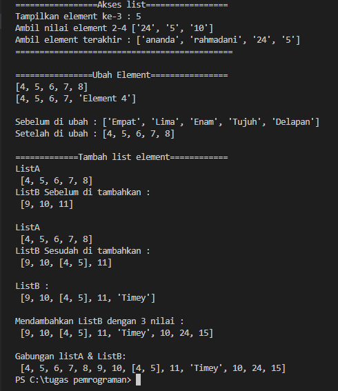
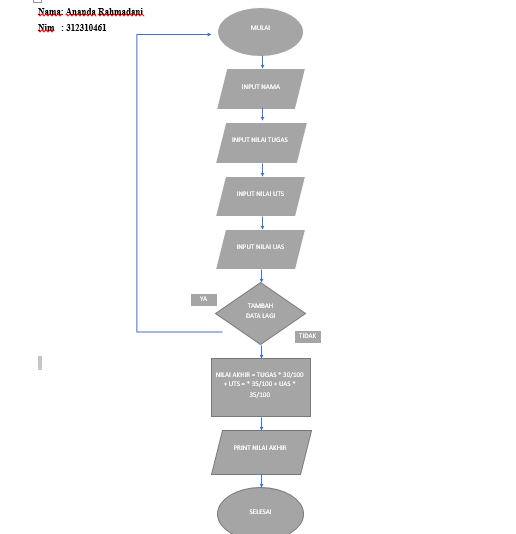
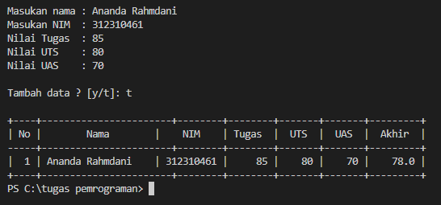

#  Pertemuan 9

| Variable | Isi |
| -------- | --- |
| *Nama* | ANANDA RAHMADANI  |
| *NIM* | 312310461 |
| *Kelas* | TI.23.A5 |
| *Mata Kuliah* | Bahasa Pemrograman |


## Latihan 
### Buat sebuah list sebanyak 5 elemen dengan nilai bebas 
#### 1. Akses list : 
- Tampilkan elemen ke 3
- Ambil nilai elemen ke 2 sampai elemen ke 4
- Ambil elemen terakhir
#### 2. Ubah elemen list:
- Ubah elemen ke 4 dengan nilai lainnya
- Ubah elemen ke 4 sampai dengan elemen terakhir
#### 3. Tambah elemen list:
- Ambil 2 bagian dari list pertama (A) dan jadikan list ke 2 (B)
- Tambah list B dengan nilai string
- Tambah list B dengan 3 nilai
- Gabungkan list B dengan list A

## 1. Akses list
#### Buat sebuah list sebanyak 5 elemen dengan nilai bebas

```python
list1 = ["ananda", "rahmadani", "24", "5", "10"]
```
#### Tampilkan elemen ke 3
```python
print("Tampilkan element ke-3 :", list1[3])  
```
#### Ambil nilai elemen ke 2 sampai elemen ke 4
```python
print("Ambil nilai element 2-4", list1[2:5])
```
#### Ambil elemen terakhir
```python
print("Ambil element terakhir :", list1[0:4])
```

## 2.Ubah elemen list:

#### Ubah elemen ke 4 dengan nilai lainnya


```python
list2 = [4, 5, 6, 7, 8]
print(list2)
list2[4] = "Element 4"
print(list2)
```

#### Ubah elemen ke 4 sampai dengan elemen terakhir
```python
list3 = ["Empat", "Lima", "Enam", "Tujuh", "Delapan"]
print("Sebelum di ubah :", list3)
list3[0:6] = [4, 5, 6, 7, 8]
print("Setelah di ubah :", list3, "\n")
```
## 3. Tambah elemen list:
```python
lista  = [4, 5, 6, 7, 8]
listb  = [9, 10, 11]
```
#### Ambil 2 bagian dari list pertama (A) dan jadikan list ke 2 (B)
```python
#  Index   0(-5),   1(-4),  2(-3),   3(-2),   4(-1) 
lista  = [4, 5, 6, 7, 8]
print("ListA\n", lista)
listb  = [9, 10, 11]
print("ListB Sebelum di tambahkan :\n", listb, "\n")  

lista  = [4 ,5 ,6 ,7 ,8]
print("ListA\n", lista)
listb  = [9 ,10 ,11 ]
listb.insert(2, lista[0:2])  
print("ListB Sesudah di tambahkan :\n", listb, "\n")
```
#### Tambah list B dengan nilai string
```python
# Mendambahkan list B dengan nilai string
listb.append("Timey")
print("ListB :\n", listb,"\n")
```
#### Tambah list B dengan 3 nilai
```python
# Menambahkan list B dengan 3 Nilai
listb.extend([10, 24, 15])
print("Mendambahkan ListB dengan 3 nilai :\n", listb,"\n")
```

#### Gabungkan list B dengan list A
```python
# Menggabungkan ListA dan ListB 
listN = lista + listb
print("Gabungan listA & ListB: \n", listN)
```

## Hasil programnya


## Tugas praktikum
Buat program sederhana untuk menambahkan data kedalam sebuah
list dengan rincian sebagai berikut:

- Progam meminta memasukkan data sebanyak-banyaknya (gunakanperulangan).

- Tampilkan pertanyaan untuk menambah data (y/t?), apabila jawabant (Tidak), maka program akan menampilkan daftar datanya.

- Nilai Akhir diambil dari perhitungan 3 komponen nilai (tugas: 30%, uts: 35%, uas: 35%).

- Buat flowchart dan penjelasan programnya pada README.md.

- Commit dan push repository ke github.
## Flowchart



## Kode program

```Python
# LIST
nama = []
nim = []
nilaiTugas = []
nilaiUTS = []
nilaiUAS = []
nilaiAkhir = []

print()

# Input
while True:
    nama.append(input("Masukan nama : "))
    nim.append(input("Masukan NIM  : "))
    Tugas = int(input("Nilai Tugas  : ")); 
    nilaiTugas.append(Tugas)
    UTS   = int(input("Nilai UTS    : ")); 
    nilaiUTS.append(UTS)
    UAS   = int(input("Nilai UAS    : ")); 
    nilaiUAS.append(UAS)

    nilaiAkhir.append(Tugas * 30/100 + UTS * 35/100 + UAS * 35/100)

    print()
    _tanya = input("Tambah data ? [y/t]: ")
    print()
    if(_tanya == "t"):
        break

# Output
print("+----+-----------------------+--------+--------+-------+-------+---------+")
print("| {0:^2} | {1:^18} | {2:^9} | {3:^6} | {4:^5} | {5:^5} | {6:^7} |".format("No", "Nama", "NIM" v, "Tugas", "UTS", "UAS", "Akhir"))
print("-----+-----------------------+--------+--------+-------+-------+---------+")

no = 0
for nama, nim, Tugas, UTS, UAS, nilaiAkhir in zip(nama, nim, nilaiTugas, nilaiUTS, nilaiUAS, nilaiAkhir):
    no += 1    
    print("| {0:>2} | {1:<18} | {2:>8} | {3:>6} | {4:>5} | {5:>5} | {6:>7} |".format(no, nama, nim, Tugas, UTS, UAS, nilaiAkhir))
print("+----+-----------------------+--------+--------+-------+-------+---------+")
```
## Maka Output Programnya

## TERIMA KASIH
